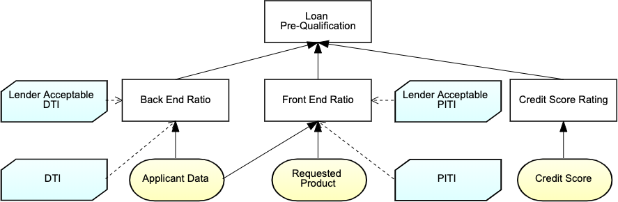
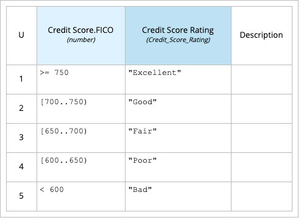

= DMN
:awestruct-description: Drools DMN engine is an open source Java(TM) implementation providing full runtime support for DMN models at Conformance level 3, meaning 100% of the features in the Standard
:awestruct-layout: learnTopicBase
:showtitle:

[.lead]
The Decision Model and Notation (DMN(TM)) is a Standard by OMG(R) providing a common and visual notation readily understandable by all users and personas: from the business analysts defining the initial decision requirements and then formalizing more detailed decision models, to the technical developers automating the decisions in processes with a portable execution semantic as defined by the Standard, to all the business stakeholders managing and monitoring those decisions.

Drools DMN engine is an open source Java(TM) implementation providing full runtime support for DMN models at Conformance level 3, meaning 100% of the features in the Standard

== At a glance

[.text-right]
[quote, Bruce Silver, 'https://methodandstyle.com/what-is-dmn[What Is DMN?]']
____
DMN is trying to do for Business Decision Management what BPMN did for Business Process Management a decade ago: empower the business to take charge of the logic that drives its operations, through a vendor-independent diagramming language.  To be effective, that language must be both usable by business analysts and stakeholders in the business and verifiable for completeness and consistency.  DMN is both.
____

.

[.text-right, cols="3a,3a", frame=none]
|===
| 
| Manage any decision complexity by decomposing and structuring decision services with Decision Requirement Graph (DRG)
|===

.

[.text-right, cols="3a,3a", frame=none]
|===
| Use Decision Table, the ultimate BA dream leveraging lots of research!
| 
|===

